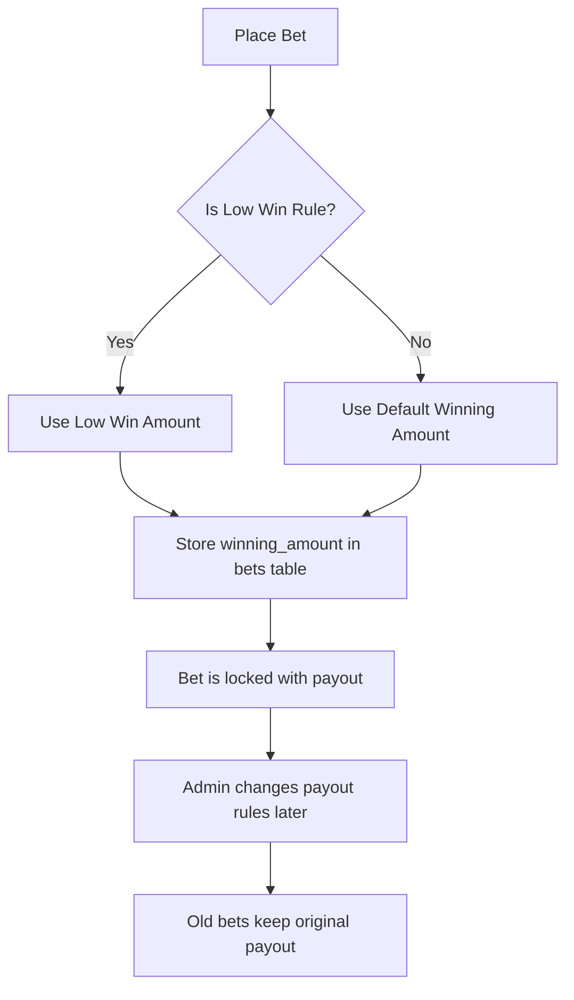

# LuckyBet API Update: Winning Amount & Low Win Integration

## Overview
This document describes recent updates to the LuckyBet API and backend logic to support flexible payout management, including both standard winning amounts and per-number/per-amount low win overrides. These changes impact both backend logic and API responses, and are important for frontend developers integrating with the system.

---

## Key Changes

### 1. **Winning Amounts Table & Model**
- New `winning_amounts` table and model.
- Associates a default payout (`winning_amount`) with each game type and bet amount.
- Managed via Filament admin panel ("Betting Management" group).

### 2. **Low Win Numbers Table & Model**
- New `low_win_numbers` table and model.
- Allows admins to set reduced payout (low win) rules for specific bet numbers or all numbers, for a given game type and amount.
- Supports both generic (all numbers) and specific (per-number) rules.

### 3. **Bet Model & Locked Payouts**
- **`winning_amount`**: Now STORED in the `bets` table at the time each bet is placed. This value is locked and will never change, even if payout rules are updated later. (For legacy bets, if the column is null, it falls back to config logic.)
- **`is_low_win`**: Boolean, true if a low win rule applies to this bet (based on the config at the time the bet was placed).
- **Why?** This ensures payout fairness, compliance, and auditability. Old bets always pay what was promised at the time of placement.

### 4. **API Response Changes**
- All Bet-related API responses (including `/bets`, `/bets/:id`, `/bets/hits`, etc.) now include:
    - `winning_amount`: The locked-in payout for this bet (from the column), or `null` for legacy bets.
    - `is_low_win`: Boolean, true if a low win rule applies.

#### Example Response (BetResource):
```json
{
  "id": 123,
  "ticket_id": "ABC123XYZ",
  "bet_number": "21",
  "amount": "2",
  "winning_amount": 1500,
  "is_low_win": true,
  "is_claimed": false,
  "is_rejected": false,
  "is_combination": false,
  "is_winner": false,
  "d4_sub_selection": null,
  "bet_date": "2025-05-16",
  "bet_date_formatted": "May 16, 2025 02:00 PM",
  "claimed_at": null,
  "claimed_at_formatted": null,
  "created_at": "2025-05-16T13:55:00.000000Z",
  "game_type": {
    "id": 1,
    "name": "S2",
    ...
  },
  "draw": {
    "id": 10,
    "draw_date": "2025-05-16",
    ...
  },
  "teller": {
    "id": 5,
    "name": "Teller Name",
    ...
  },
  "location": {
    "id": 2,
    "name": "Branch ABC",
    ...
  },
  "customer": null
}
```

#### Full BetResource Fields
- `id`: Bet ID
- `ticket_id`: Unique ticket string
- `bet_number`: The bet number
- `amount`: Bet amount (string, formatted)
- `winning_amount`: Locked payout for this bet
- `is_low_win`: True if a low win rule applies
- `is_claimed`: True if bet has been claimed
- `is_rejected`: True if bet was cancelled
- `is_combination`: Combination bet flag
- `is_winner`: True if bet is a winner (drawn)
- `d4_sub_selection`: D4 sub-selection (if any)
- `bet_date`: Date of bet
- `bet_date_formatted`: Human readable date
- `claimed_at`: Claim timestamp
- `claimed_at_formatted`: Human readable claim date
- `created_at`: Creation timestamp
- `game_type`: GameType object (see GameTypeResource)
- `draw`: Draw object (see DrawResource)
- `teller`: Teller user object
- `location`: Location object
- `customer`: Customer user object (if any)

All fields are present in every bet API response. Use these for display, reporting, and auditing.

### 5. **N+1 Optimized**
- All queries are eager loaded (`draw`, `draw.result`, `gameType`, etc.) to avoid N+1 issues.

---

## Frontend Integration Notes
- **Always display `winning_amount` to the user** for transparency.
- The `winning_amount` is now guaranteed to be the correct, locked payout for each bet. It will not change, even if admin updates payout rules later.
- If `winning_amount` is `null`, show a warning or prompt to contact admin (this should only happen for legacy bets).
- Use `is_low_win` to visually indicate reduced payout bets.

---

## How the Locked Winning Amount & Low Win Logic Works

### Visual Flow



### Practical Scenarios

#### Scenario 1: Normal Bet (No Low Win)
- User places a bet on S2, amount ₱2.
- No low win rule for this number/amount.
- System uses default winning amount (e.g., ₱1500).
- This value is stored in the bet's `winning_amount` column.
- Even if admin changes payout rules later, this bet will always pay ₱1500 if it wins.

#### Scenario 2: Low Win Bet
- User places a bet on S3, amount ₱1, number '123'.
- There is a low win rule for S3, amount 1, number '123' (e.g., ₱2000).
- System uses the low win amount (₱2000) and stores it in the bet's `winning_amount` column.
- This bet is "flagged" as low win (`is_low_win: true`).
- Admin changes payout rules later: this bet still pays ₱2000 if it wins.

#### Scenario 3: No Winning Amount Set
- User tries to place a bet on D4, amount ₱5.
- No default or low win payout is set for this configuration.
- System returns an error: "Winning amount is not set for this game type and amount. Please contact admin."
- No bet is saved, preventing undefined payouts.

### Key Takeaways
- **Every bet is locked with its payout at placement time.**
- **Old bets are never affected by admin changes.**
- **Low win rules are applied automatically and flagged for frontend.**
- **API always returns the correct, locked payout for display and reporting.**

- See `database/migrations/2025_05_16_205104_create_winning_amounts_table.php` and `2025_05_06_032800_create_low_win_numbers_table.php` for schema.
- See `WinningAmount.php` and `LowWinNumber.php` for model logic.

---

## Contact
For questions or integration support, contact the backend team.

---

**Release Date:** 2025-05-16
