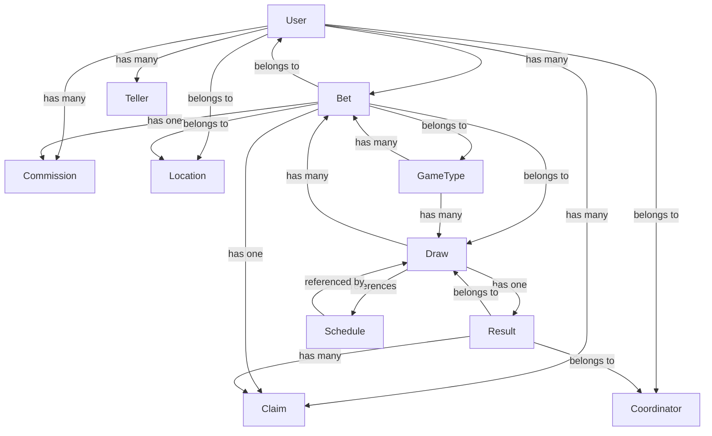

# LuckyBet Core System Structure

## Core Models Overview

This document outlines the core models and their relationships in the LuckyBet system.

## Entity Relationship Diagram



## Model Details

### User Model
- **Role**: Authentication and User Management
- **Key Attributes**:
  - username
  - password
  - name
  - email
  - phone
  - role
  - profile_image
  - is_active
  - location_id
  - coordinator_id
- **Relationships**:
  - Belongs to Location
  - Has many Bets
  - Has many Claims
  - Has many Commissions
  - Belongs to Coordinator (self-referential)
  - Has many Tellers (self-referential)

### Bet Model
- **Role**: Betting Transactions
- **Key Attributes**:
  - bet_number
  - amount
  - draw_id
  - game_type_id
  - teller_id
  - customer_id
  - location_id
  - bet_date
  - ticket_id
  - is_claimed
  - is_rejected
  - is_combination
- **Relationships**:
  - Belongs to Draw
  - Belongs to GameType
  - Belongs to User (as teller)
  - Belongs to User (as customer)
  - Belongs to Location
  - Has one Claim
  - Has one Commission

### Draw Model
- **Role**: Draw Management
- **Key Attributes**:
  - draw_date
  - draw_time
  - is_open
  - is_active
- **Relationships**:
  - Has many Bets
  - Has one Result
  - References Schedule (for draw_time)

### Result Model
- **Role**: Draw Results Management
- **Key Attributes**:
  - draw_id
  - draw_date
  - draw_time
  - s2_winning_number
  - s3_winning_number
  - d4_winning_number
  - coordinator_id
- **Relationships**:
  - Belongs to Draw
  - Belongs to User (as coordinator)
  - Has many Claims

### GameType Model
- **Role**: Game Configuration
- **Key Attributes**:
  - name
  - code
  - is_active
- **Relationships**:
  - Has many Bets
  - Has many Draws

### Schedule Model
- **Role**: Draw Time Management
- **Key Attributes**:
  - name (e.g., "2:00 PM")
  - draw_time (System time format)
  - is_active
- **Relationships**:
  - Referenced by Draws (for draw_time reference)
- **Purpose**:
  - Manages available draw times
  - Controls active/inactive draw schedules
  - Provides consistent time format across the system

## Data Flow

1. **Betting Process**:
   - User (Teller) creates a Bet
   - Bet is associated with a Draw and GameType
   - Bet is linked to a Location
   - Draw time is referenced from Schedule (e.g., 2:00 PM, 3:00 PM)

2. **Draw Process**:
   - Draw is created with specific date and time (referencing Schedule)
   - Multiple Bets can be associated with a Draw
   - Result is recorded after the draw
   - Each draw time (2:00 PM, 3:00 PM, etc.) has its own set of bets

3. **Result Process**:
   - Coordinator records the Result
   - Result is linked to the Draw
   - Claims can be processed based on Results

4. **Commission Process**:
   - Commissions are generated for Bets
   - Commissions are linked to Tellers

## Key Features

1. **Multi-level User Management**:
   - Coordinator-Teller hierarchy
   - Location-based organization

2. **Flexible Betting System**:
   - Multiple game types
   - Combination bets support
   - Location-based betting
   - Multiple draw times per day (2:00 PM, 3:00 PM, etc.)

3. **Result Management**:
   - Multiple game type results
   - Coordinator-based result entry
   - Claim processing system

4. **Commission Structure**:
   - Per-bet commission tracking
   - Teller-based commission management

5. **Schedule Management**:
   - Configurable draw times (2:00 PM, 3:00 PM, etc.)
   - Active/inactive schedule control
   - Consistent time format across system

## Example Visualizations

### Mobile Card Grid Layout with Draw Times

```
+----------------------------------------------------------+
|              DETAILED TALLYSHEET REPORT                   |
+----------------------------------------------------------+
| Date: May 8, 2025  [Calendar Icon]  [< Prev] [Next >]    |
+----------------------------------------------------------+
| Draw Time: 2:00 PM  [Time Selector]                      |
+----------------------------------------------------------+
| Total Amount: 1,135.00                                   |
+----------------------------------------------------------+
| [S2]  |  [S3]  |  [D4]  |  [ALL]                         |
+----------------------------------------------------------+

+---------------+  +---------------+  +---------------+
|      00       |  |      01       |  |      02       |
|               |  |               |  |               |
|    270.0      |  |     50.0      |  |    185.0      |
|               |  |               |  |               |
|      S2       |  |      S2       |  |      S2       |
|    2:00 PM    |  |    2:00 PM    |  |    2:00 PM    |
+---------------+  +---------------+  +---------------+

+---------------+  +---------------+
|      03       |  |      05       |
|               |  |               |
|     60.0      |  |    325.0      |
|               |  |               |
|      S3       |  |      S3       |
|    2:00 PM    |  |    2:00 PM    |
+---------------+  +---------------+

+---------------+  +---------------+
|      07       |  |      09       |
|               |  |               |
|    105.0      |  |    140.0      |
|               |  |               |
|      D4       |  |      D4       |
|    2:00 PM    |  |    2:00 PM    |
+---------------+  +---------------+
```

### Table Layout with Draw Times

```
+----------------------------------------------------------+
|              DETAILED TALLYSHEET REPORT                   |
|                    May 8, 2025                           |
|                    Draw Time: 2:00 PM                    |
+----------------------------------------------------------+
| SUMMARY                                                  |
| Total Amount: 1,135.00                                   |
+----------------------------------------------------------+
| BET BREAKDOWN BY GAME TYPE                               |
+----------------------------------------------------------+
|         S2         |         S3         |        D4        |
+----------------------------------------------------------+
| Bet# | Amount      | Bet# | Amount      | Bet# | Amount    |
| Time |             | Time |             | Time |           |
+----------------------------------------------------------+
| 00   | 270.0       | 03   | 60.0        | 07   | 105.0     |
| 2PM  |             | 2PM  |             | 2PM  |           |
| 01   | 50.0        | 05   | 325.0       | 09   | 140.0     |
| 2PM  |             | 2PM  |             | 2PM  |           |
| 02   | 185.0       |      |             |      |           |
| 2PM  |             |      |             |      |           |
+----------------------------------------------------------+
```

The visualizations now show how draw times (2:00 PM, 3:00 PM, etc.) are integrated into both the card grid and table layouts. Users can:
- Select specific draw times
- View bets organized by draw time
- See clear time indicators for each bet
- Filter and group bets by both game type and draw time 